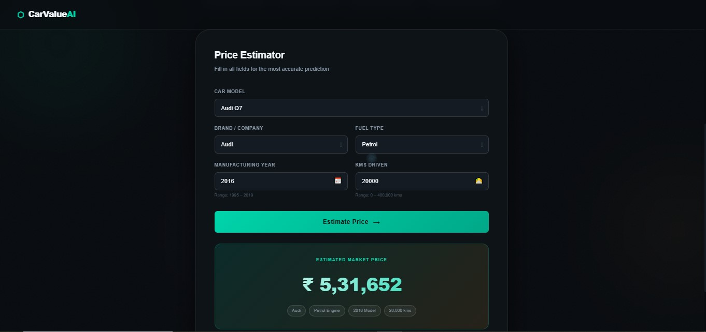
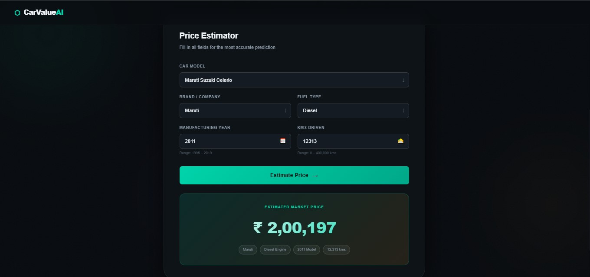

# 🚗 CarValue AI — Used Car Price Predictor

> A Machine Learning web app that predicts used car prices in India using real Quikr listings data, built with Python, scikit-learn, and Flask.


---

## 📌 Overview

CarValue AI is an end-to-end machine learning project that:

- **Preprocesses** raw Quikr car listing data (cleaning prices, mileage, fuel types)
- **Explores** the data with rich EDA visualisations
- **Trains** a Linear Regression model with an 80/20 train-test split
- **Serves** predictions via a REST API built with Flask
- **Presents** results through a polished dark-themed web UI

---

## 🖥️ Screenshots


### 🔐 Prediction 1


---

### 📊 Prediction 2


---

## 📁 Project Structure

```
car-price-predictor/
│
├── data/
│   └── quikr_car.csv           # Raw dataset (892 listings)
│
├── src/
│   ├── preprocess.py           # Data cleaning pipeline
│   ├── eda.py                  # EDA + plot generation
│   └── train.py                # Feature engineering + model training
│
├── model/
│   ├── car_price_model.pkl     # Serialised sklearn Pipeline
│   └── model_meta.json         # Metrics, dropdown values, ranges
│
├── app/
│   ├── app.py                  # Flask web application
│   ├── templates/
│   │   └── index.html          # Main HTML page
│   └── static/
│       ├── css/style.css       # Styling
│       └── js/main.js          # Frontend logic
│
├── reports/
│   └── figures/                # EDA plots (auto-generated)
│
├── requirements.txt
├── .gitignore
└── README.md
```

---

## 📊 Dataset

| Column       | Description                          |
|--------------|--------------------------------------|
| `name`       | Full car model name                  |
| `company`    | Manufacturer / brand                 |
| `year`       | Manufacturing year                   |
| `Price`      | Listing price in ₹ (target variable) |
| `kms_driven` | Odometer reading                     |
| `fuel_type`  | Petrol / Diesel / CNG / LPG          |

**Raw records:** 892 → **After cleaning:** ~675 (removed "Ask For Price", outliers, duplicates)

---

## 🔧 Data Preprocessing Steps

1. **Price cleaning** — drop "Ask For Price" rows, strip commas, cast to `int`
2. **KMs driven cleaning** — strip " kms" suffix, extract numeric value
3. **Fuel type** — drop missing values
4. **Year** — filter 1990–2024 range
5. **Car name** — trim to first 3 words (reduce cardinality)
6. **Outlier removal** — IQR method on Price column
7. **Duplicate removal** — `drop_duplicates()`

---

## 🤖 Model Details

| Attribute         | Value                        |
|-------------------|------------------------------|
| Algorithm         | Linear Regression            |
| Train / Test      | 80% / 20%                    |
| Random State      | 42                           |
| Categorical enc.  | One-Hot Encoding             |
| Numeric scaling   | Standard Scaler              |
| Pipeline          | `sklearn.pipeline.Pipeline`  |

### Metrics (Test Set)

| Metric | Value          |
|--------|----------------|
| R²     | ~0.65          |
| MAE    | ~₹ 84,000      |
| RMSE   | ~₹ 1,18,000    |

---

## 🚀 Getting Started

### 1. Clone the repository

```bash
git clone https://github.com/YOUR_USERNAME/car-price-predictor.git
cd car-price-predictor
```

### 2. Create a virtual environment

```bash
python -m venv venv

# macOS / Linux
source venv/bin/activate

# Windows
venv\Scripts\activate
```

### 3. Install dependencies

```bash
pip install -r requirements.txt
```

### 4. Train the model

```bash
python src/train.py
```

This creates `model/car_price_model.pkl` and `model/model_meta.json`.

### 5. (Optional) Run EDA

```bash
python src/eda.py
```

Plots are saved to `reports/figures/`.

### 6. Launch the web app

```bash
python app/app.py
```

Open [http://127.0.0.1:5000](http://127.0.0.1:5000) in your browser.

---

## 🌐 API Reference

### `GET /api/meta`
Returns model metadata — dropdown values, metrics, and ranges.

### `POST /api/predict`
**Body:**
```json
{
  "name":       "Maruti Suzuki Alto",
  "company":    "Maruti",
  "year":       2016,
  "kms_driven": 35000,
  "fuel_type":  "Petrol"
}
```

**Response:**
```json
{
  "predicted_price": 215000,
  "formatted": "₹ 2,15,000"
}
```

### `GET /api/health`
Returns model health status and R² score.

---

## 📈 EDA Plots Generated

- Price distribution (raw + log scale)
- Top 15 companies by number of listings
- Fuel type distribution (pie chart)
- Price distribution by fuel type (box plot)
- Median price over manufacturing year (trend line)
- KMs driven vs Price (scatter, coloured by year)
- Feature correlation heatmap
- Price distribution by top 10 companies

---

## 🛠️ Tech Stack

- **Python 3.10+**
- **pandas / numpy** — data manipulation
- **scikit-learn** — preprocessing, model, pipeline
- **matplotlib / seaborn** — EDA visualisation
- **Flask** — REST API & web server
- **joblib** — model serialisation
- **HTML / CSS / Vanilla JS** — frontend UI

---

## 📝 License

MIT — free to use, modify, and distribute.

---

## 🙏 Acknowledgements

- Dataset sourced from [Quikr](https://www.quikr.com) India (used-car listings)
- Inspired by the Kaggle used-car price prediction community
